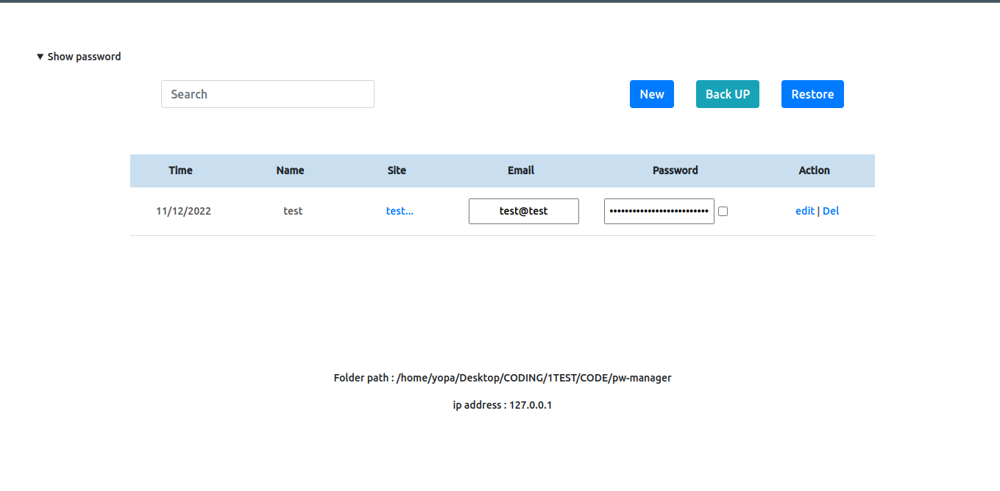

# Foobar

node js app to manage passwords

> demo result app


## Installation

Use the package manager [npm]() to install this.

```bash
git clone https://github.com/yopaaa/pw-manager.git
```

## Usage

> create .env in root folder 

EXAMPLE

```bash
MAIN_PORT=8000
MAIN_HOST='0.0.0.0'
USER_NAME='anonim@anonim.com'
AUTH_PASS='secure'
```

> Run the app
```bash
# install node modules
npm install

# run the server you can use
npm run test      # for testing
npm run restart   # for developer
npm run startProd # for production

```

## Contributing

Pull requests are welcome. For major changes, please open an issue first
to discuss what you would like to change.

Please make sure to update tests as appropriate.

## License

[MIT](https://choosealicense.com/licenses/mit/)


